# Agent H.A.L.O. / NucleusDB — System Architecture Diagrams

> Auto-rendered by GitHub. For local rendering: `npx @mermaid-js/mermaid-cli -i Docs/SYSTEM_DIAGRAM.md`

---

## 1. Top-Level System Context (C4 Level 1)

Who uses the system, and what external systems does it touch.

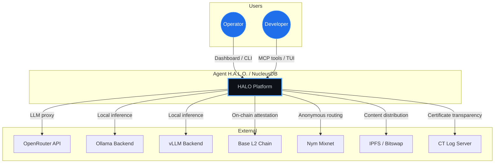

---

## 2. Binary Targets & Entry Points

The six executables and how they relate.

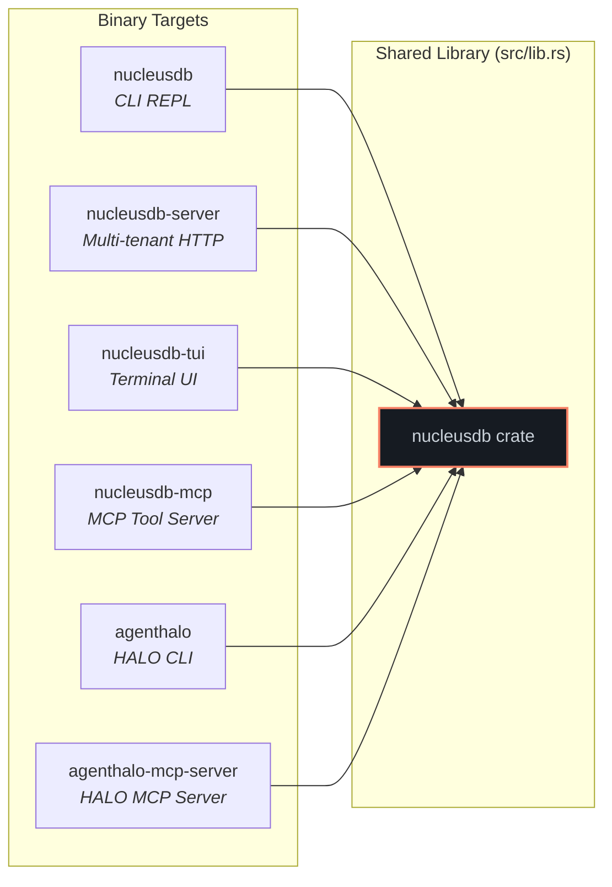

---

## 3. High-Level Module Architecture (C4 Level 2)

Major subsystems and their data flow.

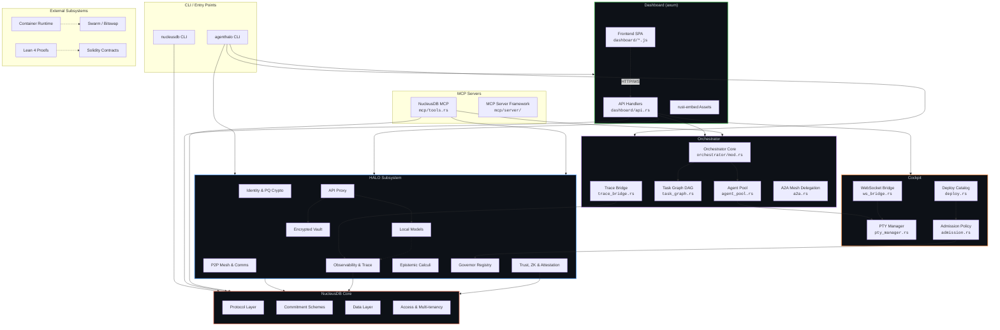

---

## 4. NucleusDB Core — Internal Structure

The verifiable database engine.

```mermaid
graph TB
    subgraph Protocol["Protocol Layer"]
        NDBP["NucleusDb Trait<br/><code>protocol.rs</code>"]
        STATE["State + Delta<br/><code>state.rs</code>"]
        PERSIST["Snapshot + WAL<br/><code>persistence.rs</code>"]
        KEYMAP["Key-to-Index Map<br/><code>keymap.rs</code>"]
        IMMUT["Append-Only Keys<br/><code>immutable.rs</code>"]
    end

    subgraph Commitment["Commitment & Verification"]
        IPA["IPA Backend<br/><code>vc/ipa.rs</code>"]
        KZG["KZG Backend<br/><code>vc/kzg.rs</code>"]
        MERKLE["Binary Merkle<br/><code>vc/binary_merkle.rs</code>"]
        WITNESS["Witness Signatures<br/>Ed25519 + ML-DSA-65"]
        SEC["Security Profiles<br/><code>security.rs</code>"]
        TRANS["CT Log Integration<br/><code>transparency/</code>"]
    end

    subgraph Data["Data Layer"]
        TV["8 Typed Values<br/><code>typed_value.rs</code>"]
        TM["Type Map<br/><code>type_map.rs</code>"]
        VI["Vector Index (kNN)<br/><code>vector_index.rs</code>"]
        BLOB["Blob Store (SHA-256)<br/><code>blob_store.rs</code>"]
        SQL["SQL Parser + Executor<br/><code>sql/</code>"]
        MEM["Memory Store<br/><code>memory.rs</code>"]
        EMB["Embeddings<br/><code>embeddings.rs</code>"]
    end

    subgraph Access["Access Control"]
        POD["Solid POD Protocol<br/><code>pod/</code>"]
        MT["Multi-tenant RBAC<br/><code>multitenant.rs</code>"]
        LIC["CAB License Gate<br/><code>license.rs</code>"]
    end

    NDBP --> STATE
    NDBP --> KEYMAP
    NDBP --> IMMUT
    STATE --> PERSIST

    NDBP -- "commit proof" --> IPA
    NDBP -- "commit proof" --> KZG
    NDBP -- "commit proof" --> MERKLE
    NDBP -- "sign" --> WITNESS
    IPA --> SEC
    KZG --> SEC

    SQL --> NDBP
    VI --> EMB
    MEM --> VI
    MEM --> BLOB
    MEM --> EMB
    TV --> TM
    NDBP --> TV

    POD --> NDBP
    MT --> NDBP
    MT --> LIC

    style Protocol fill:#1a1e24,stroke:#f78166,stroke-width:2px,color:#c9d1d9
    style Commitment fill:#1a1e24,stroke:#d29922,stroke-width:2px,color:#c9d1d9
    style Data fill:#1a1e24,stroke:#58a6ff,stroke-width:2px,color:#c9d1d9
    style Access fill:#1a1e24,stroke:#3fb950,stroke-width:2px,color:#c9d1d9
```

---

## 5. HALO Subsystem — Internal Structure

Sovereign agent identity, communication, and observability.

```mermaid
graph TB
    subgraph Identity["Identity & Post-Quantum Crypto"]
        DID["DID Document<br/>Ed25519 + ML-DSA-65"]
        GSEED["Genesis Seed<br/>BIP-39 Mnemonic"]
        GENTROPY["Genesis Entropy"]
        IDLEDGER["Identity Ledger<br/>Hash-chained (SHA-512)"]
        PQ["PQ Wallet<br/>ML-DSA-65"]
        HASH["Hash Dispatch<br/>SHA-256 / SHA-512"]
        HKEM["Hybrid KEM<br/>X25519 + ML-KEM-768"]
        EVMW["EVM Wallet<br/>secp256k1 BIP-32"]
        EVMG["EVM PQ Gate<br/>Dual-sign before secp256k1"]
        TWINE["Twine Anchor<br/>CURBy-Q Triple-signed"]
    end

    subgraph Comms["P2P Mesh & Communication"]
        P2PN["libp2p Swarm<br/>Noise XX + Gossipsub + Kademlia"]
        P2PD["Discovery<br/>DHT + GossipPrivacy"]
        A2AB["A2A Bridge<br/>DIDComm HTTP"]
        DCOMM["DIDComm v2<br/>Hybrid KEM Authcrypt"]
        DCOMMH["DIDComm Handler"]
        STARTUP["Full Stack Bootstrap"]
        NYMM["Nym SOCKS5 Proxy"]
        NYMN["Nym Native Sphinx"]
    end

    subgraph Observe["Observability & Trace"]
        SCHEMA["TraceEvent Schema"]
        TRACE["TraceWriter / Reader<br/>redb-backed"]
        WRAP["Agent Wrapper<br/>stdin/stdout intercept"]
        RUNNER["Process Runner"]
        DETECT["Agent Auto-detect"]
        VIEWER["Session Exporter"]
        ADAPT["Adapters<br/>Claude | Codex | Gemini | Generic"]
    end

    subgraph TrustZK["Trust, ZK & Attestation"]
        ATTEST["Session Attestation<br/>Merkle SHA-512"]
        TRUSTS["Trust Scores + Epistemic<br/>Heyting Algebra"]
        CIRC["Groth16 ZK Circuits<br/>BN254 arkworks"]
        CIRCPOL["Circuit Policy<br/>Dev vs Prod"]
        ZKCOMP["ZK Compute Receipts"]
        ZKCRED["ZK Credentials<br/>Anonymous Membership"]
        AUDIT_H["Solidity Static Analysis"]
    end

    subgraph Epistemic["Epistemic Calculi"]
        DIVERS["Tsallis Diversity<br/>Strategy diversity gauge"]
        EVID["Evidence Combiner<br/>Bayesian odds-update"]
        UNCERT["Uncertainty Translation<br/>Probability / CF / Possibility"]
        TTOPO["Trace Topology<br/>H0 Persistence (Rips)"]
    end

    subgraph ServingProxy["Serving & Proxy"]
        PRXY["API Proxy<br/>OpenAI-compat multi-provider"]
        LMOD["Local Models<br/>Ollama + vLLM"]
        VLT["Encrypted Vault<br/>AES-256-GCM"]
        PRICE["Token Pricing"]
        X402M["HTTP 402 Payments"]
        GOV["Governor Registry<br/>AETHER gain/stability"]
        GOVTEL["Governor Telemetry"]
        CHEV["Chebyshev Evictor"]
        ADM["Admission Policy<br/>Warn / Block / Force"]
    end

    GSEED --> DID
    GENTROPY --> GSEED
    DID --> PQ
    DID --> HKEM
    EVMG --> EVMW
    EVMG --> PQ
    TWINE --> DID

    P2PN --> P2PD
    P2PN --> DCOMM
    DCOMM --> HKEM
    DCOMMH --> DCOMM
    A2AB --> DCOMM
    STARTUP --> P2PN
    STARTUP --> NYMM
    NYMN --> NYMM

    WRAP --> ADAPT
    WRAP --> SCHEMA
    RUNNER --> WRAP
    DETECT --> RUNNER
    SCHEMA --> TRACE
    VIEWER --> TRACE

    ATTEST --> TRACE
    TRUSTS --> TRACE
    CIRC --> CIRCPOL
    ZKCRED --> CIRC

    DIVERS --> TRACE
    TTOPO --> TRACE
    EVID --> TRUSTS

    PRXY --> VLT
    PRXY --> LMOD
    PRXY --> PRICE
    PRXY --> X402M
    ADM --> GOV
    GOV --> GOVTEL
    CHEV --> GOV

    style Identity fill:#1a1e24,stroke:#d2a8ff,stroke-width:2px,color:#c9d1d9
    style Comms fill:#1a1e24,stroke:#58a6ff,stroke-width:2px,color:#c9d1d9
    style Observe fill:#1a1e24,stroke:#3fb950,stroke-width:2px,color:#c9d1d9
    style TrustZK fill:#1a1e24,stroke:#d29922,stroke-width:2px,color:#c9d1d9
    style Epistemic fill:#1a1e24,stroke:#f47067,stroke-width:2px,color:#c9d1d9
    style ServingProxy fill:#1a1e24,stroke:#f0883e,stroke-width:2px,color:#c9d1d9
```

---

## 6. Cockpit & Orchestrator — Agent Lifecycle

How agents are launched, managed, and traced.

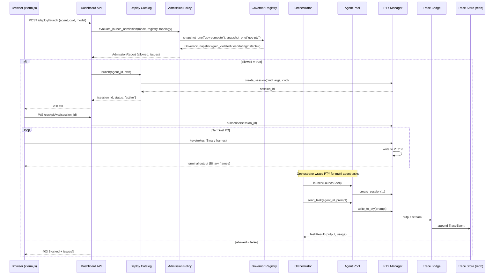

---

## 7. Proxy & Local Model Routing

Request routing through the API proxy.

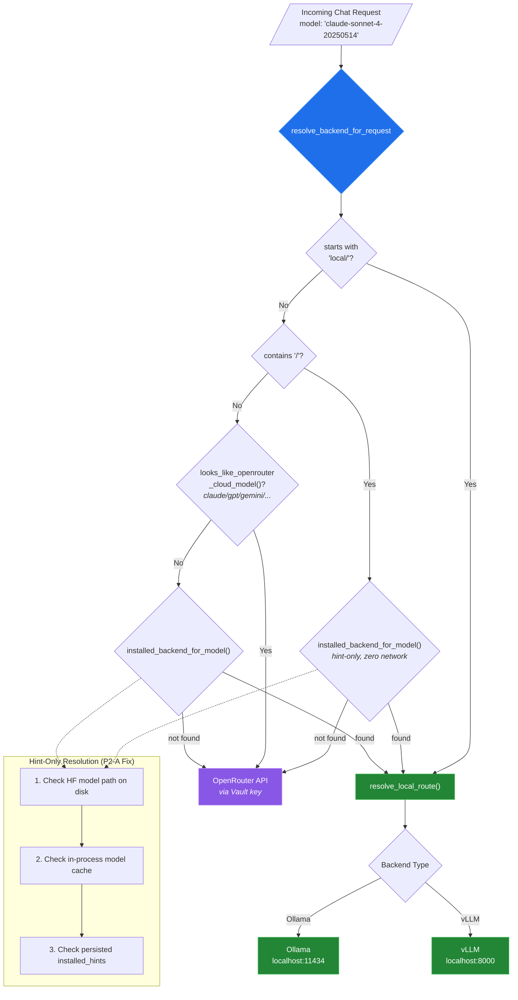

---

## 8. Post-Quantum Cryptographic Stack

Key hierarchy and signing/encryption paths.

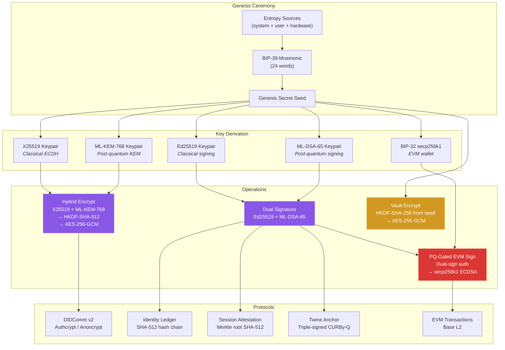

---

## 9. Container & Mesh Networking

Docker container lifecycle with P2P mesh.

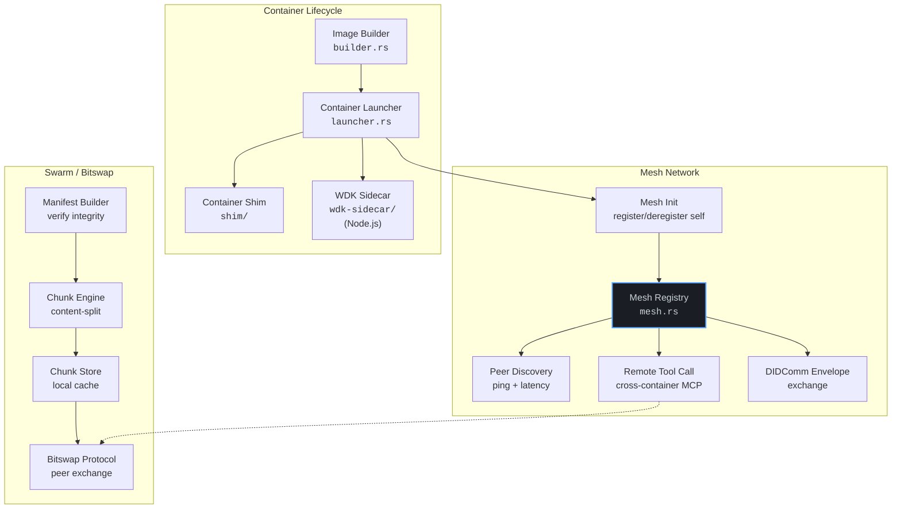

---

## 10. Dashboard Frontend Architecture

SPA page routing and module structure.

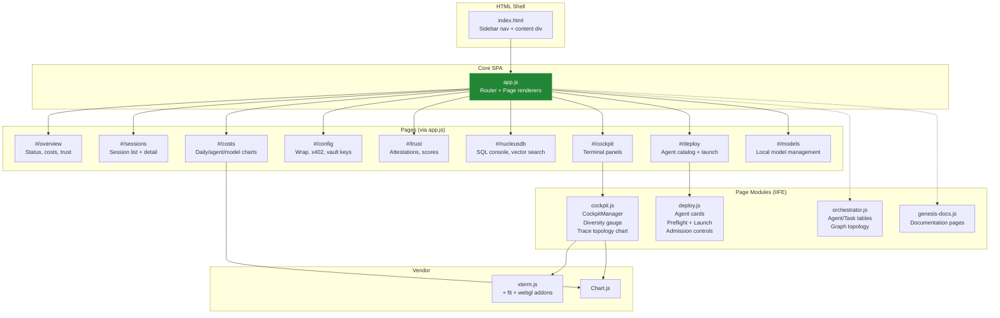

---

## 11. MCP Tool Surface

Tools exposed to AI agents via MCP protocol.

```mermaid
graph TB
    subgraph "MCP Server Framework"
        RMCP["rmcp crate<br/>JSON-RPC transport"]
        AUTH_MCP["Auth Layer<br/><code>server/auth.rs</code>"]
        REMOTE_MCP["Remote Bridge<br/><code>server/remote.rs</code>"]
    end

    subgraph "NucleusDB Tools"
        T_GET["nucleusdb_get"]
        T_SET["nucleusdb_set"]
        T_DEL["nucleusdb_delete"]
        T_SQL["nucleusdb_sql"]
        T_VEC["nucleusdb_vector_search"]
        T_BLOB["nucleusdb_blob_store / _get"]
        T_MEM["nucleusdb_memorize / _recall"]
        T_CHUNK["nucleusdb_chunk / _reassemble"]
        T_VCS["nucleusdb_work_record_*"]
        T_VERIFY["nucleusdb_verify"]
    end

    subgraph "Orchestrator Tools"
        T_LAUNCH["orchestrator_launch"]
        T_TASK["orchestrator_send_task"]
        T_PIPE["orchestrator_pipe"]
        T_GRAPH["orchestrator_graph"]
        T_MESH["orchestrator_mesh_status"]
        T_STOP["orchestrator_stop"]
    end

    subgraph "HALO Tools"
        T_ATTEST["agenthalo_attest"]
        T_TRUST["agenthalo_trust"]
        T_EVID["agenthalo_evidence_combine"]
        T_UNCERT["agenthalo_uncertainty_translate"]
        T_DEPLOY_T["deploy_preflight / _launch"]
        T_ADMIT["agenthalo_admission_check"]
    end

    subgraph "Container Tools"
        T_CLNCH["container_launch"]
        T_CLOGS["container_logs"]
        T_CSTOP["container_stop"]
        T_CMESH["mesh_*"]
    end

    RMCP --> AUTH_MCP
    RMCP --> REMOTE_MCP

    RMCP --> T_GET
    RMCP --> T_LAUNCH
    RMCP --> T_ATTEST
    RMCP --> T_CLNCH

    style RMCP fill:#1f6feb,stroke:#58a6ff,color:#fff
```

---

## 12. Lean 4 Formal Verification Layer

Proof modules that back the Rust runtime.

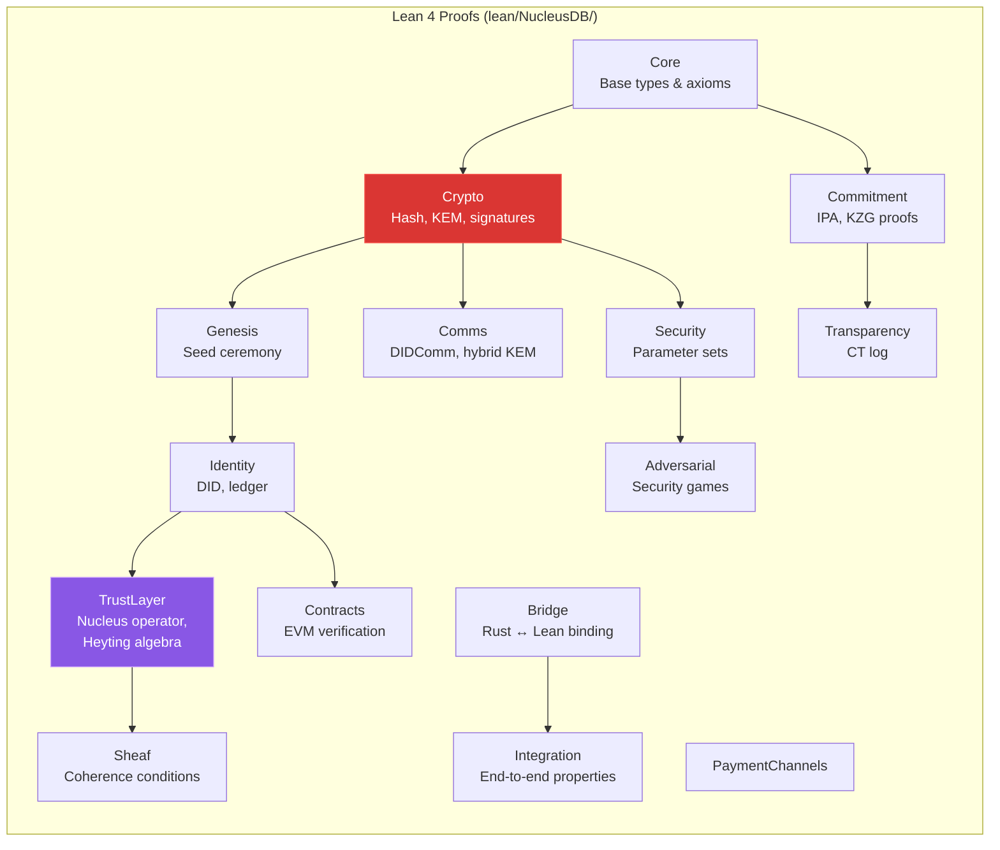

---

## 13. On-Chain Attestation Flow

Session attestation to Base L2.

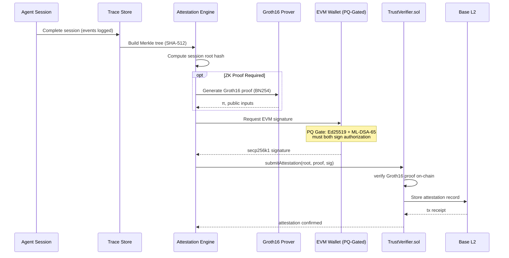

---

## 14. Data Flow — Memory Recall Pipeline

How agent memory is stored and retrieved.

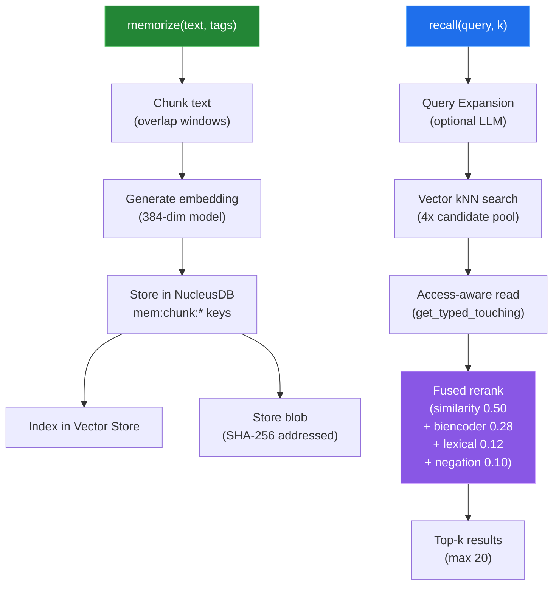

---

## 15. Complete File Map

Module-to-file reference for the entire codebase.

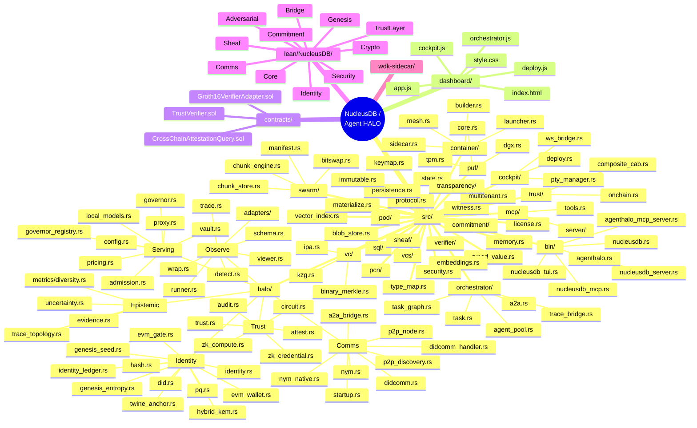
